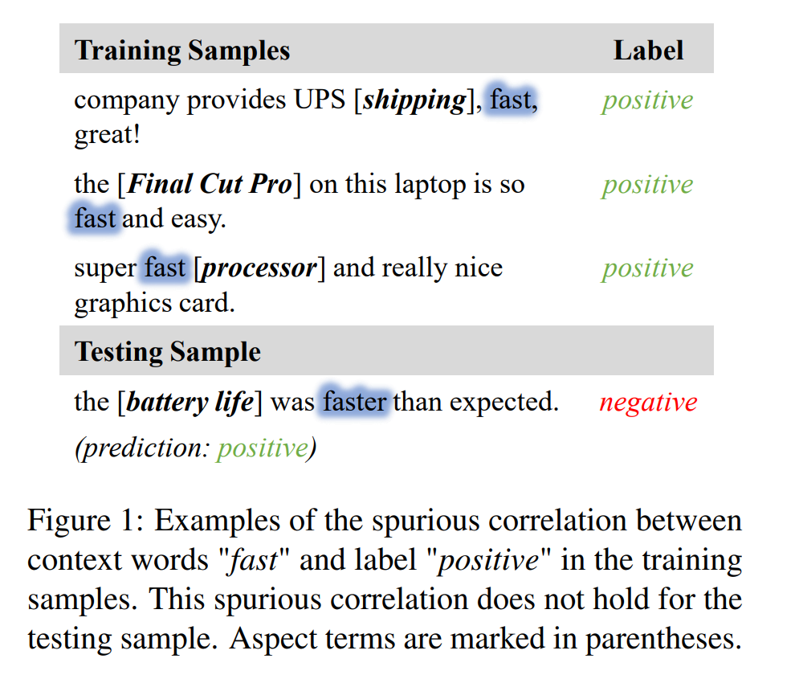
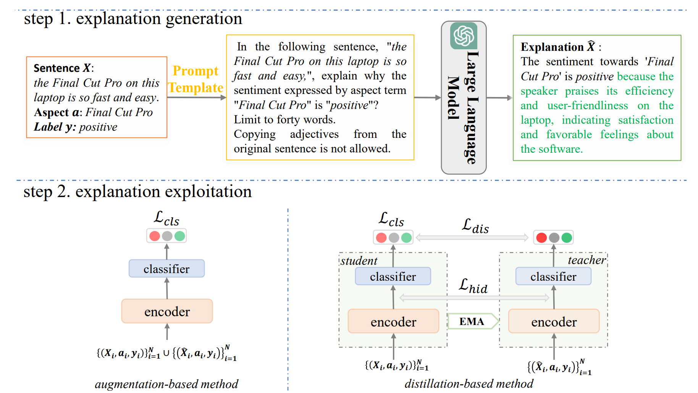
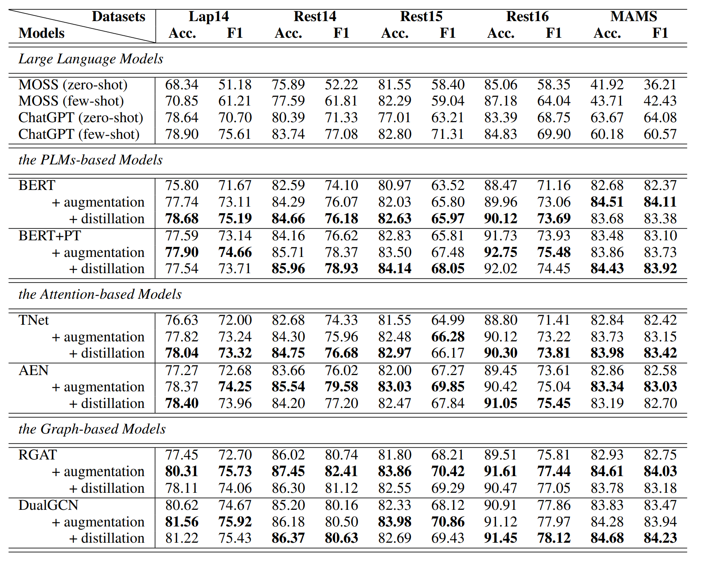

## Reducing Spurious Correlations in Aspect-based Sentiment Analysis with Explanation from Large Language Models


---
### Abstract
Recently, aspect-based sentiment analysis (ABSA) models have yielded promising results. However, 
* they are susceptible to learning spurious correlations between certain words of the input text and output labels while modeling the sentiment feature of the aspect. This spurious correlation will potentially undermine the performance of ABSA models.
<p align="center">
  
</p>

One direct solution for this problem is to make the model see and learn an explanation of sentiment expression rather than certain words. Motivated by this, we exploit explanations for the sentiment polarity of each aspect from large language models (LLMs) to reduce spurious correlations in ABSA. 
1. First, we formulate a prompt template that wraps the sentence, an aspect, and the sentiment label. This template is utilized to prompt LLMs to generate an appropriate explanation that states the sentiment cause.
2. Then, we propose two straightforward yet effective methods to leverage the explanation for preventing the learning of spurious correlations.

We conducted extensive comparative experiments on five datasets by integrating them with some representative ABSA models. 

###  Overview
<p align="center">
  
</p>

As shown in Figure, our framework consists of two steps. 
1) The first step is explanation generation. Here, for each training sample, we use a prompt template to encapsulate the sentence, the aspect, and its sentiment to drive the LLMs to generate an explanation to indicate the corresponding sentiment cause.
2) The second step is explanation exploitation. Here, we propose two simple yet effective methods to exploit explanations for alleviating the spurious correlations in ABSA.


### Main Results
<p align="center">
  
</p>


---
### Follow the steps below to run the code:
1. download pre trained model weights from [huggingface](https://huggingface.co/docs/transformers/model_doc/bert), and put it in `./pretrain_models` directory
2. download data according to references
3. use large models to generate explanation of data (some examples can see [MOSS](https://github.com/OpenLMLab/MOSS) and [ChatGPT](https://platform.openai.com/docs/introduction))
7. install packages (see `requirements.txt`)
8. run `.run_bash/*.sh`

---
### Cite
```
@inproceedings{wang-etal-2023-reducing,
    title = "Reducing Spurious Correlations in Aspect-based Sentiment Analysis with Explanation from Large Language Models",
    author = "Wang, Qianlong  and Ding, Keyang  and Liang, Bin  and Yang, Min  and Xu, Ruifeng",
    booktitle = "Findings of the Association for Computational Linguistics: EMNLP 2023",
    month = dec,
    year = "2023",
    address = "Singapore",
    publisher = "Association for Computational Linguistics",
    pages = "2930--2941",
}

```

